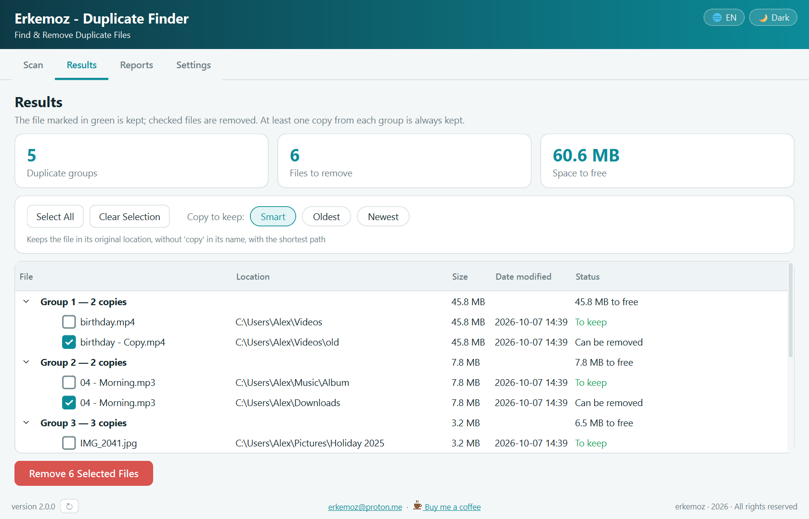
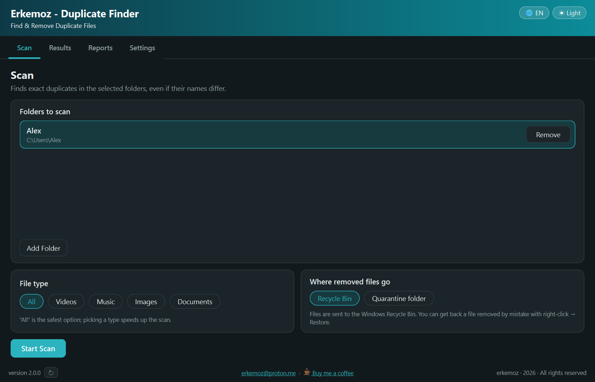

  

<h1 align="center">Erkemoz - Duplicate Finder</h1>

  <b>Ücretsiz mükerrer dosya bulucu ve temizleyici — Windows</b> 
  <i>Free duplicate file finder &amp; remover for Windows</i>

  <a href="https://github.com/erkemoz-wq/erkemoz-duplicate-finder/releases/latest"><b>⬇ Son sürümü indir · Download the latest version</b></a> 
  <code>ErkemozDuplicateFinder_Kurulum_x.y.z.exe</code> · Windows 10 / 11 (64-bit) 
  🌐 <a href="https://erkemoz.app/duplicate-finder/">erkemoz.app</a>

  
  &nbsp;&nbsp;
  

---

## Türkçe

### Neler yapar
- Seçtiğin klasörlerde (alt klasörler dahil) **birebir aynı** dosyaları bulur; adları, tarihleri, konumları farklı olsa da içerikten tanır.
- Üç aşamalı eleme: boyut → dosya uçları → tam içerik (BLAKE2b). Aynı çıkanlar bayt bayt aynıdır.
- Her gruptan **en az bir kopya mutlaka korunur**. Hangi kopyanın kalacağını sen seçersin (akıllı / en eski / en yeni ya da tek tık).
- Silinenler **Geri Dönüşüm Kutusu**'na ya da **karantina klasörüne** gider — kalıcı silme yok.
- Her tarama ve temizlik için Excel raporu; hangi dosyanın nereye gittiği kayıtlı.
- 8 dil, açık ve koyu tema. Yeni sürüm çıkınca program haber verir ve tek tıkla güncellenir.

### Kurulum
1. Yukarıdaki bağlantıdan kurulum dosyasını indir ve çalıştır.
2. Windows **"Bilgisayarınız Windows tarafından korundu"** derse **Ek bilgi → Yine de çalıştır**'a tıkla. Program henüz ücretli bir kod imzalama sertifikasıyla imzalı olmadığı için bu uyarı çıkabilir.

### Gizlilik
Taradığın dosyaların adı, içeriği ya da konumu hiçbir yere gönderilmez. Kaç bilgisayarda kurulu olduğunu ve ne kadar kullanıldığını saymak için yalnızca **rastgele bir kurulum numarası, sürüm, arayüz dili ve programın açık olup olmadığı** bilgisi gönderilir; sunucu IP adresini kaydetmez. Ayarlar sekmesindeki **"Anonim kullanım istatistiği gönder"** kutusunun işaretini kaldırırsan hiçbir şey gönderilmez.

### Bilmen gerekenler
- Kısayollar, bağlantılar (junction), sistem dosyaları ve buluttan indirilmemiş dosyalar taranmaz. Windows, Program Files, AppData gibi klasörler varsayılan olarak dışlanır.
- Tarama sonrasında değişen dosya silinmez, atlanır ve raporlanır.
- Program makine koduna derlenir ve her açılışta kendi dosyalarının mührünü denetler; değiştirilmiş bir kopya açılmaz. **Yalnız bu sayfadaki resmi sürümü indir.**
- 🛡 Her sürüm yayınlanırken otomatik olarak **VirusTotal**'da taranır; raporun linki ve sonucu [sürüm notunda](https://github.com/erkemoz-wq/erkemoz-duplicate-finder/releases/latest) yazar. Bazen yapay zekâ tahminiyle tarayan tek tük bir motor imzasız programlara yanlış alarm verebilir.

---

## English

### Features
- Finds **byte-identical** files in the folders you choose (including subfolders), even if their names, dates or locations differ.
- Three-step filtering: size → file ends → full content (BLAKE2b). Matches are identical byte for byte.
- **At least one copy of every group is always kept.** You choose which one stays (smart / oldest / newest, or one click).
- Removed files go to the **Recycle Bin** or a **quarantine folder** — nothing is deleted permanently.
- An Excel report for every scan and cleanup records where each file went.
- 8 languages, light and dark theme. The app tells you when a new version is out and updates with one click.

### Installation
1. Download the installer from the link above and run it.
2. If Windows shows **"Windows protected your PC"**, click **More info → Run anyway**. This can appear because the app is not yet signed with a paid code-signing certificate.

### Privacy
The names, contents and locations of the files you scan are never sent anywhere. To count how many computers it is installed on and how much it is used, the app sends only **a random installation number, the version, the interface language and whether the app is running**; the server does not store your IP address. Uncheck **"Send anonymous usage statistics"** on the Settings tab and nothing is sent.

### Good to know
- Shortcuts, links (junctions), system files and cloud files that aren't downloaded are not scanned. Folders such as Windows, Program Files and AppData are excluded by default.
- A file that changed after the scan is never removed; it is skipped and reported.
- The app is compiled to native code and verifies its own files on every start; a modified copy will not run. **Only download the official release from this page.**
- 🛡 Every release is automatically scanned on **VirusTotal**; the report link and result are in the [release notes](https://github.com/erkemoz-wq/erkemoz-duplicate-finder/releases/latest). Occasionally a single ML-based engine may false-flag unsigned apps.

---

☕ Program işine yaradıysa / If it helps you: <a href="https://buymeacoffee.com/erkemoz"><b>Bana bir kahve ısmarla · Buy me a coffee</b></a>

© erkemoz · <a href="mailto:erkemoz@proton.me">erkemoz@proton.me</a> · Ücretsizdir / Free to use · Değiştirilip dağıtılamaz / Do not modify or redistribute

